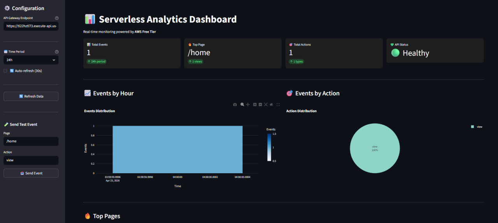

# 🚀 Serverless Analytics API

**Real-time analytics platform built with AWS serverless services - 100% Free Tier compatible!**

Monitor your application events, track user behavior, and visualize metrics in real-time without managing any servers.


---

## 📋 Table of Contents

- [Features](#-features)
- [Architecture](#-architecture)
- [AWS Services Used](#-aws-services-used)
- [Cost Breakdown](#-cost-breakdown)
- [Prerequisites](#-prerequisites)
- [Quick Start](#-quick-start)
- [API Documentation](#-api-documentation)
- [Dashboard](#-dashboard)
- [Monitoring](#-monitoring)
- [Troubleshooting](#-troubleshooting)
- [Project Structure](#-project-structure)

---

## ✨ Features

- **📊 Real-time Analytics** - Track events as they happen
- **🎯 Multiple Event Types** - Page views, clicks, purchases, custom events
- **📈 Interactive Dashboard** - Built with Streamlit for beautiful visualizations
- **🔒 Secure** - IAM-based security with least privilege
- **💰 Cost-effective** - 100% within AWS Free Tier limits
- **⚡ Serverless** - Auto-scaling, no server management
- **🧹 Auto-cleanup** - DynamoDB TTL removes old data automatically
- **📱 CORS Enabled** - Works with any web/mobile app
- **🔍 CloudWatch Integration** - Full logging and monitoring

---

## 🏗️ Architecture

```
┌─────────────┐
│   Client    │ (Web/Mobile App)
│  (Postman)  │
└──────┬──────┘
       │ HTTPS
       ▼
┌─────────────────────┐
│   API Gateway       │ ← REST API (1M requests/month FREE)
│   /events (POST)    │
│   /stats (GET)      │
│   /events/recent    │
│   /health (GET)     │
└──────┬──────────────┘
       │
       ▼
┌─────────────────────┐
│   Lambda Function   │ ← Python 3.11 (1M invocations FREE)
│   (handler.py)      │ ← Event processing & routing
└──────┬──────────────┘
       │
       ├────────────────────┐
       ▼                    ▼
┌─────────────┐      ┌─────────────┐
│  DynamoDB   │      │  CloudWatch │
│  (NoSQL)    │      │  (Logs)     │
│  25GB FREE  │      │  5GB FREE   │
└─────────────┘      └─────────────┘
       │
       ▼
┌─────────────────────┐
│  Streamlit Dashboard│ ← Run locally or deploy
│  (dashboard.py)     │
└─────────────────────┘
```

**Data Flow:**
1. Client sends event to API Gateway
2. API Gateway triggers Lambda function
3. Lambda processes event and stores in DynamoDB
4. Dashboard queries stats via API
5. CloudWatch logs everything for monitoring

---

## 🛠️ AWS Services Used

| Service | Purpose | Free Tier Limit | Your Usage |
|---------|---------|----------------|------------|
| **Lambda** | Event processing | 1M requests/month | ~50K/month ✅ |
| **API Gateway** | REST API | 1M calls/month | ~50K/month ✅ |
| **DynamoDB** | NoSQL database | 25GB storage | ~1GB ✅ |
| **CloudWatch Logs** | Monitoring | 5GB logs/month | ~500MB ✅ |
| **CloudWatch Alarms** | Alerting | 10 alarms | 3 alarms ✅ |
| **S3** | Dashboard hosting (optional) | 5GB storage | ~10MB ✅ |

**Total Monthly Cost: $0.00** 💰

---

## 💰 Cost Breakdown

### Free Tier (First 12 months)

✅ **Lambda**
- 1M requests/month
- 400,000 GB-seconds compute time
- **Your usage:** ~50K requests = **FREE**

✅ **API Gateway**
- 1M REST API calls/month
- **Your usage:** ~50K calls = **FREE**

✅ **DynamoDB**
- 25GB storage
- 25 write capacity units (WCU)
- 25 read capacity units (RCU)
- **Your usage:** ~1GB, On-Demand = **FREE**

✅ **CloudWatch**
- 5GB log ingestion
- 10 custom metrics
- 10 alarms
- **Your usage:** ~500MB logs = **FREE**

### After Free Tier (Month 13+)

Estimated cost with 50K events/month: **~$2-3/month**

- Lambda: $0.20
- API Gateway: $0.50
- DynamoDB: $1.00
- CloudWatch: $0.50
- **Total: ~$2.20/month**

---

## 📚 Prerequisites

### Required
- **AWS Account** (Free Tier eligible)
- **AWS CLI** installed and configured
- **Python 3.11+** (for local testing)
- **Git** (for version control)

### Optional
- **Postman** (for API testing)
- **VS Code** (recommended IDE)

---

## 🚀 Quick Start

### Step 1: Clone Repository

```bash
git clone https://github.com/RSangDev/serverless-analytics-aws.git
cd serverless-analytics-aws
```

### Step 2: Deploy CloudFormation Stack

```bash
# Package Lambda function
cd lambda
zip -r function.zip handler.py
cd ..

# Create S3 bucket for deployment (replace BUCKET_NAME)
aws s3 mb s3://serverless-analytics-proj-analytics-deploy

# Package CloudFormation template
aws cloudformation package \
    --template-file cloudformation/template.yaml \
    --s3-bucket YOUR-BUCKET-NAME-analytics-deploy \
    --output-template-file packaged-template.yaml

# Deploy stack
aws cloudformation deploy \
    --template-file packaged-template.yaml \
    --stack-name analytics-api-stack \
    --capabilities CAPABILITY_IAM \
    --parameter-overrides ProjectName=analytics-api

# Get outputs
aws cloudformation describe-stacks \
    --stack-name analytics-api-stack \
    --query 'Stacks[0].Outputs'
```

**Expected Output:**
```json
[
  {
    "OutputKey": "ApiEndpoint",
    "OutputValue": "https://abc123xyz.execute-api.us-east-1.amazonaws.com/prod"
  },
  {
    "OutputKey": "DynamoDBTable",
    "OutputValue": "analytics-api-events"
  },
  {
    "OutputKey": "LambdaFunction",
    "OutputValue": "analytics-api-function"
  }
]
```

### Step 3: Update Lambda Code

```bash
# Zip Lambda function
cd lambda
zip function.zip handler.py

# Update Lambda function
aws lambda update-function-code \
    --function-name analytics-api-function \
    --zip-file fileb://function.zip

cd ..
```

### Step 4: Test API

```bash
# Set your API endpoint
export API_ENDPOINT="https://YOUR-API-ID.execute-api.REGION.amazonaws.com/prod"

# Health check
curl $API_ENDPOINT/health

# Send test event
curl -X POST $API_ENDPOINT/events \
  -H "Content-Type: application/json" \
  -d '{"page": "/home", "action": "view"}'

# Get statistics
curl $API_ENDPOINT/stats?period=24h

# Get recent events
curl $API_ENDPOINT/events/recent?limit=10
```

### Step 5: Run Dashboard

```bash
# Install dependencies
cd dashboard
pip install -r requirements.txt

# Run Streamlit dashboard
streamlit run dashboard.py

# Dashboard opens at http://localhost:8501
```

**Configure Dashboard:**
1. Enter your API endpoint in the sidebar
2. Click "Save"
3. Dashboard will start showing data!

---

## 📖 API Documentation

### Base URL
```
https://YOUR-API-ID.execute-api.REGION.amazonaws.com/prod
```

### Endpoints

#### 1. Create Event
```http
POST /events
Content-Type: application/json

{
  "page": "/products",
  "action": "view",
  "metadata": {
    "product_id": "123",
    "category": "electronics"
  }
}
```

**Response (201):**
```json
{
  "message": "Event created",
  "event_id": "550e8400-e29b-41d4-a716-446655440000",
  "timestamp": "2026-02-16T12:00:00.000Z"
}
```

#### 2. Get Statistics
```http
GET /stats?period=24h
```

**Parameters:**
- `period`: `24h`, `7d`, or `30d` (default: `24h`)

**Response (200):**
```json
{
  "period": "24h",
  "total_events": 1547,
  "top_pages": [
    {"page": "/home", "count": 523},
    {"page": "/products", "count": 412}
  ],
  "actions": {
    "view": 1200,
    "click": 347
  },
  "hourly_distribution": {
    "2026-02-16T12": 45,
    "2026-02-16T13": 67
  },
  "generated_at": "2026-02-16T14:30:00.000Z"
}
```

#### 3. Get Recent Events
```http
GET /events/recent?limit=20
```

**Parameters:**
- `limit`: Number of events (default: `20`, max: `100`)

**Response (200):**
```json
{
  "events": [
    {
      "event_id": "550e8400-...",
      "timestamp": "2026-02-16T14:29:30.000Z",
      "page": "/checkout",
      "action": "click"
    }
  ],
  "count": 20
}
```

#### 4. Health Check
```http
GET /health
```

**Response (200):**
```json
{
  "status": "healthy",
  "timestamp": "2026-02-16T14:30:00.000Z",
  "service": "analytics-api"
}
```

#### 5. Delete Old Events
```http
DELETE /events?days=90
```

**Parameters:**
- `days`: Delete events older than X days (default: `90`)

**Response (200):**
```json
{
  "message": "Deleted 150 old events",
  "deleted_count": 150
}
```

---

## 📊 Dashboard

### Features
- 📈 Real-time metrics (Total events, Today, This week)
- 🎯 Events by action (Pie chart)
- 📊 Hourly distribution (Bar chart)
- 🔥 Top pages ranking
- ⏱️ Recent events feed (Live updates)
- 🧪 Test event sender (Built-in)
- 🔄 Auto-refresh (Optional)

### Running Locally

```bash
cd dashboard
pip install -r requirements.txt
streamlit run dashboard.py
```

### Screenshots

*(Add screenshots here after deployment)*

---

## 🔍 Monitoring

### CloudWatch Logs

View Lambda logs:
```bash
aws logs tail /aws/lambda/analytics-api-function --follow
```

### CloudWatch Metrics

Check Lambda metrics:
```bash
aws cloudwatch get-metric-statistics \
    --namespace AWS/Lambda \
    --metric-name Invocations \
    --dimensions Name=FunctionName,Value=analytics-api-function \
    --start-time $(date -u -d '1 hour ago' +%Y-%m-%dT%H:%M:%S) \
    --end-time $(date -u +%Y-%m-%dT%H:%M:%S) \
    --period 300 \
    --statistics Sum
```

### DynamoDB Metrics

Check table size:
```bash
aws dynamodb describe-table \
    --table-name analytics-api-events \
    --query 'Table.TableSizeBytes'
```

---

## 🐛 Troubleshooting

### Issue: "Access Denied" when deploying CloudFormation

**Solution:**
```bash
# Verify AWS credentials
aws sts get-caller-identity

# Ensure you have admin permissions or these policies:
# - CloudFormationFullAccess
# - IAMFullAccess
# - AWSLambdaFullAccess
# - AmazonAPIGatewayAdministrator
# - AmazonDynamoDBFullAccess
```

### Issue: Lambda function returns 500 error

**Solution:**
```bash
# Check CloudWatch logs
aws logs tail /aws/lambda/analytics-api-function --since 10m

# Common causes:
# 1. DynamoDB table name mismatch
# 2. IAM permissions missing
# 3. Invalid JSON in request
```

### Issue: Dashboard shows "N/A" for all metrics

**Solution:**
1. Verify API endpoint is correct
2. Check CORS is enabled on API Gateway
3. Send a test event first
4. Check browser console for errors

### Issue: DynamoDB exceeding Free Tier

**Solution:**
```bash
# Enable TTL (auto-delete old data)
aws dynamodb update-time-to-live \
    --table-name analytics-api-events \
    --time-to-live-specification "Enabled=true, AttributeName=ttl"

# Or manually delete old events
curl -X DELETE "$API_ENDPOINT/events?days=30"
```

---

## 📁 Project Structure

```
serverless-analytics-aws/
├── lambda/
│   ├── handler.py           # Lambda function code
│   ├── requirements.txt     # Python dependencies (empty - uses stdlib)
│   └── function.zip         # Packaged for deployment
├── dashboard/
│   ├── dashboard.py         # Streamlit dashboard
│   └── requirements.txt     # Dashboard dependencies
├── cloudformation/
│   └── template.yaml        # Infrastructure as Code
├── docs/
│   ├── architecture.png     # Architecture diagram
│   └── api-examples.md      # API usage examples
├── scripts/
│   ├── deploy.sh            # Deployment automation
│   ├── test-api.sh          # API testing script
│   └── cleanup.sh           # Resource cleanup
├── .gitignore
├── README.md                # This file
└── LICENSE
```

---

## 🎯 Use Cases

- **E-commerce Analytics** - Track product views, cart adds, purchases
- **Blog Metrics** - Monitor page views, reading time, shares
- **SaaS Product Analytics** - Feature usage, user engagement
- **Mobile App Events** - Screen views, button clicks, errors
- **Marketing Campaigns** - Track clicks, conversions, attribution

---

## 🚀 Next Steps

### Enhancements

1. **Add Authentication**
   - Implement API Keys (API Gateway)
   - Or use AWS Cognito for user auth

2. **Advanced Analytics**
   - User sessions tracking
   - Funnel analysis
   - Cohort analysis

3. **Alerting**
   - CloudWatch Alarms for high error rates
   - SNS notifications
   - Slack/Discord webhooks

4. **Data Export**
   - S3 data lake integration
   - Athena queries
   - QuickSight dashboards

5. **CI/CD Pipeline**
   - GitHub Actions workflow
   - Automated testing
   - Blue/green deployments

---
## 📸 Screenshots

### Dashboard



## 🤝 Contributing

Contributions welcome! Please:

1. Fork the repository
2. Create a feature branch
3. Commit your changes
4. Push to the branch
5. Open a Pull Request

---

## 📧 Contact

Questions? Issues? Suggestions?

- **GitHub Issues:** [Open an issue](https://github.com/RSangDev/serverless-analytics-aws/issues)
- **Email:** your.email@example.com

---

## ⭐ Show Your Support

If this project helped you, please give it a ⭐ on GitHub!

---

**Built with ❤️ using AWS Free Tier**

*Zero cost, infinite possibilities! 🚀*